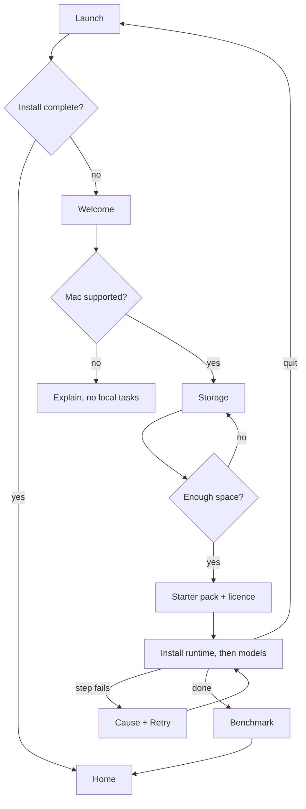

# Flow — First launch (F1)

- Trigger: the app starts and `runtime/state.json` does not record a completed install.
- Covers: AC-01, AC-02, AC-03, AC-04.

## Steps
1. App shows Welcome → user continues.
2. System probes chip, unified memory, macOS version → assigns a tier.
3. User keeps the default storage location or picks another volume → system checks free space
   against the proposed pack.
4. System proposes a starter pack for the tier with download size and disk after conversion →
   user accepts or changes it.
5. User acknowledges the model licence notice.
6. System installs the runtime, then the models, as a checklist with per-item progress; every
   completed step is written to `runtime/state.json`.
7. System runs the benchmark render and stores seconds per step → Home.

## Branches and failure paths
- Unsupported Mac at step 2 → explanation in plain language; no local task is offered (AC-04).
- Not enough free space at step 3 or 4 → the pack cannot be accepted; the shortfall is shown and a
  smaller pack or another volume is offered.
- Network failure at step 6 → the step shows the cause and Retry (AC-03); completed items stay done.
- Quit at any point → relaunch resumes at the first incomplete step (AC-02).
- Checksum mismatch → see `model-install.md`.
- Benchmark fails → the task is still usable; ETAs show "not calibrated" until a render succeeds.

